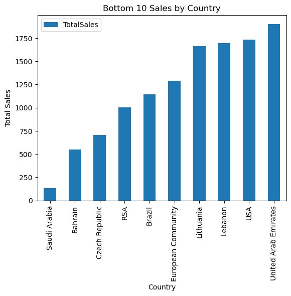

# Final Report For Group 31

## Introduction
Our team chose to analysze data from UK based store because this topic was interesting for all of us. The dataset was found in The UCI Machine Learning Repository and is licensed under a Creative Commons Attribution 4.0 International (CC BY 4.0). This data set contains all transactions of 4000 customers between 01/12/2010 and 09/12/2011 for an online retailer based in the UK. The retailer sells unique gifts for every occasion. Wholesalers make up a large part of the company's customers. This table has eight columns: InvoiceNo, StockCode, Description, Quantity, InvoiceDate, UnitPrice, CustomerID, Country, and 541909 instances.

## Analysis One
The goal of this analysis is to identify customer segments for UK based retail company using RFM analysis and to understand how those groups differ from each other and try to predict customer lifetime value for the company.

Customer segmentation is an effective tool for businesses to closely align their strategy and tactics with, and better target, their customers. Every customer is different and every customer journey is different so a single approach often isn’t going to work for all. This is where customer segmentation becomes a valuable process. Customer segmentation is the process by which you divide your customers into segments up based on common characteristics – such as demographics or behaviors, so you can market to those customers more effectively.

RFM (Recency-Frequency-Monetary) analysis is a simple technique for behaviour based customer segmentation. It groups customers based on their transaction history – how recently, how often and how much did they buy. It is a handy method to find the best customers, understand their behavior and then run targeted marketing campaigns to increase sales, satisfaction and customer lifetime value. The system assigns each customer numerical scores based on these factors to provide an objective analysis. RFM analysis is based on the marketing adage that "80% of your business comes from 20% of your customers."

Here we can see what each group represent in terms of Scores and approach for each of the segments.

| Id  | Segment                   | Description                                                                                                                                                                          | R   | F   | M   |
|-----|---------------------------|--------------------------------------------------------------------------------------------------------------------------------------------------------------------------------------|-----|-----|-----|
| 1   | Champions                 | Reward these users. They promote your products and they can be early adopters for your new launches                                                                                  | 4-5 | 4-5 | 4-5 |
| 2   | Loyal Customers           | These users are responsive to your promotions. Suggest higher-value products to them. Also, leverage them for reviews                                                                | 4-5 | 1-5 | 1-5 |
| 3   | Potential Loyalist        | Engage them with long-term offers like loyalty programs or membership rewards. Suggest other categories of products to them                                                          | 3-5 | 1-4 | 1-4 |
| 4   | New Customers             | For new users, make their onboarding experience smooth and provide assistance when needed                                                                                            | 4-5 | 0-1 | 0-1 |
| 5   | Promising                 | Convert them into loyal customers by creating brand awareness and giving free trials                                                                                                 | 3-4 | 0-1 | 0-1 |
| 6   | Needs Attention           | You need to bring back these customers. Provide limited period offers and recommend products based on their purchase history (Above average recency, frequency & monetary values)    | 2-3 | 2-3 | 2-3 |
| 7   | About To Sleep            | Swoop in before you lose them. Recommend popular products and provide membership discounts. Reactivate them as soon as possible (Below average recency, frequency & monetary values) | 2-3 | 0-2 | 0-2 |
| 8   | At Risk (Price Sensitive) | These are users looking for the best deal. Recommend highest-rated products and send discount communication (Spent big money, purchased often but long time ago)                     | 0-3 | 1-5 | 1-5 |
| 9   | Can`t Lose Them           | Listen to their feedback, suggest newer products and make them stick to your platform (Made big purchases and often, but long time ago)                                              | 0-1 | 4-5 | 4-5 |
| 10  | Hibernating               | Recommend relevant products from other categories and provide personalized offers (Low spenders, low frequency, purchased long time ago)                                             | 0-2 | 0-2 | 0-2 |

After calculating all RFM scores, we can see distribution of Customers by Segements.

As we can see, the largest segment group is hibernating. Which stands for low spenders with low frequency and who purchased long time ago.

To better understand how segments depends on RFM scores. We can check the average score distribution of Recency, Frequency and Monetary.

As expected, scatterplot visualizes the set of rules applied to generate RFM segments. 'Champions' and 'loyal customers' are the ones who buy the most often and who made their last order recently. 'New customers' and 'promising' made purchases not long time ago but they are not frequent buyers yet. And 'hibernating' customers are the ones with the lowest recency and frequency scores. "Can't lose" are customers who made purchase long time ago, but made a lot of purchases.

 If you want plot with all observation and not just average values by segments. 

The first part of this study focused on understanding what we should observe in this data by studying customer behavior. We analyzed customer data by splitting them into ten groups, and discovered that hibernation is the largest group. Our conclusion is that this is the result of the products offered in this store. Due to the fact that this store sells gifts for occasions, most clients will have low frequency and recency scores. And we assume that customers from champions and loyal customers are most likely some local shops that resell those special gifts. Therefore, they have pretty high recency, frequency, and monetary scores.

## Analysis Two

## Analysis Three

For this analysis I decided to take an approach from a marketing perspective. For every business an essential part of growing as a company is establishing your brand or company. Through word of mouth marketing or whatever the case may be if no one knows about your business no one could support your business. When looking into the dataset the large majority of the orders that are placed are from the United Kingdom, as the store is located in the United Kingdom this only makes sense.

Looking at the bar chart we can truly see how big of a difference there is between outside the UK and the UK. For lots of companies seeing this would be plenty reason enough to continue to focus their marketing efforts in UK as that's where they see the most success.
Assuming that this company is interested in branching outside the UK it gives plenty reason to look into the amount of orders they receive from other countries and decide where else they could focus their marketing efforts. I decided to take a look into the top 10 countries without the UK to help better inform the decision of where they could branch out their marketing techniques.

We can see that the Netherlands is the second most popular country with this store. If desired the store could take the approach of increasing marketing in areas where they already have a little bit of footing, instead of jumping straight to places where they receive little to no orders as that could be the case due to external factors such as political climate or cultural differences.

 

As we can see looking at the bottom 10 for sales we can see that Saudi Arabia has placed the least amount of orders totalling under 250.
This could be due to the points of cultural differences and this store simply offering nothing of relevance to this country.
The aim of my research on this dataset was to give the business the insight on where their orders are from. More specifically help guide them on where they want to take a deeper look into why their orders originate from where they do. What are they doing in Saudi Arabia to have little to no orders, Similarly what are they doing right in the Netherlands? These questions will become increasingly relevant to this business as they continue to grow and expand their market place.

# Conclusion

The work described in this project is based on a database providing details on purchases made on an E-commerce platform over a period of one year. Each entry in the dataset describes the purchase of a product, by a particular customer and at a given date. In total, approximately 
4000 clients appear in the database. 

